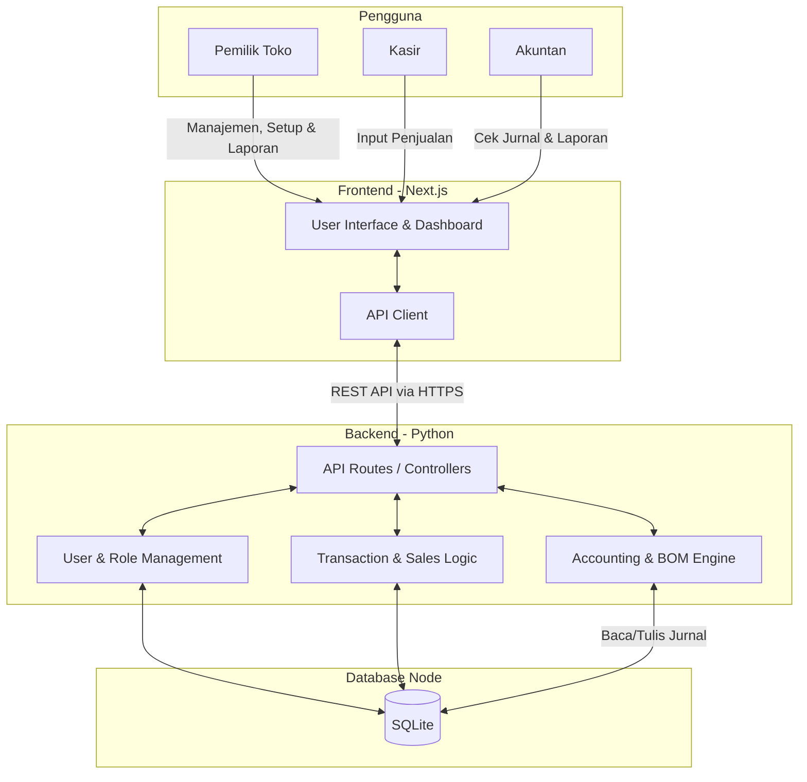
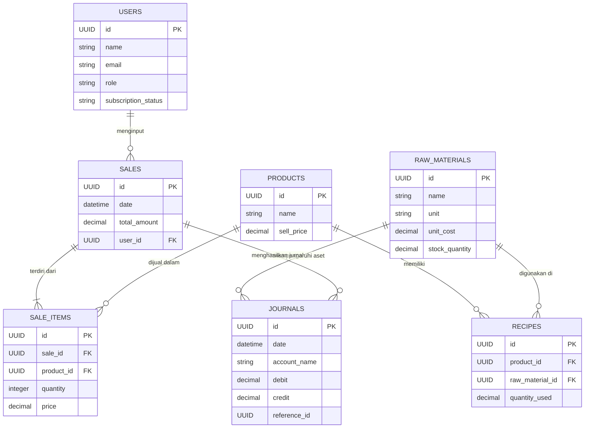

# PRD — Project Requirements Document

## 1. Overview
Banyak usaha toko roti kesulitan melacak keuntungan bersih yang sebenarnya karena rumitnya menghitung modal bahan baku yang terpakai untuk setiap roti yang terjual. Aplikasi SaaS ini dirancang khusus sebagai "Buku Kas Toko Roti" cerdas. Tujuan utama aplikasi ini adalah mengotomatiskan perhitungan laba bersih dan melacak nilai bahan baku sebagai aset habis pakai berdasarkan teori akuntansi yang teruji. Dengan sistem resep otomatis (Bill of Materials), pengguna dapat mengetahui secara pasti berapa biaya yang dikeluarkan dan keuntungan yang didapat setiap kali transaksi penjualan diinput.

## 2. Requirements
- **Prinsip Akuntansi Standar:** Sistem harus mencatat perhitungan berbasis *double-entry* di latar belakang untuk memastikan neraca seimbang, di mana bahan baku diakui sebagai aset (persediaan) dan berkurang otomatis saat produksi/penjualan.
- **Dukungan Multi-Peran:** Aplikasi harus mendukung 3 jenis hak akses: Pemilik Toko (Admin utama), Akuntan (Fokus pada laporan keuangan), dan Kasir (Fokus pada pencatatan penjualan).
- **Perhitungan Resep Otomatis (BOM):** Setiap roti (produk jadi) harus dikaitkan dengan resep bahan baku. Saat penjualan dimasukkan, sistem secara otomatis mengurangi stok bahan baku dan menghitung Harga Pokok Penjualan (HPP).
- **Laporan Otomatis:** Sistem harus mampu mencetak 4 laporan akuntansi wajib: Neraca Keuangan, Laba Rugi, Arus Kas (Cash Flow), dan Buku Besar.
- **Model Monetisasi:** Menggunakan skema *Freemium*, di mana pengguna bisa menggunakan fitur dasar secara gratis (dengan batasan tertentu) dan membayar untuk fitur penuh/premium.

## 3. Core Features
- **Manajemen Pengguna & Otorisasi:** Sistem login/registrasi dengan pembagian peran (Pemilik, Kasir, Akuntan). Manajemen langganan/paket Freemium.
- **Master Data Bahan Baku & Produk:** Formulir untuk menambahkan daftar bahan baku beserta nilai belinya (sebagai aset), dan daftar roti yang dijual beserta harga jualnya.
- **Manajemen Resep (BOM - Bill of Materials):** Fitur untuk meracik resep, yang menghubungkan 1 produk roti dengan beberapa bahan baku beserta takarannya.
- **Input Penjualan & Pembelian Manual:** 
  - Kasir dapat menginput data roti yang terjual secara manual.
  - Akuntan/Pemilik dapat menginput data pembelian/restok bahan baku secara manual.
- **Mesin Akuntansi Latar Belakang:** Secara otomatis mengubah input penjualan menjadi jurnal akuntansi (mengurangi aset persediaan, menambah kas, mencatat beban, dan pendapatan).
- **Dashboard & Laporan Keuangan:** Tampilan grafik ringkasan keuangan dan halaman khusus untuk melihat/mengunduh Laba Rugi, Neraca, Arus Kas, dan Buku Besar.

## 4. User Flow
1. **Pendaftaran (Pemilik Toko):** Pemilik mendaftar ke aplikasi, mengatur profil toko, dan mulai menggunakan paket gratis.
2. **Setup Data Awal:** Pemilik/Akuntan menginput stok dan harga beli Bahan Baku awal -> membuat Produk Roti -> memasukkan Resep untuk roti tersebut.
3. **Pencatatan Penjualan harian:** Kasir login, masuk ke menu penjualan, dan menginput jumlah dan jenis roti yang laku hari itu.
4. **Proses Otomatis (Sistem):** Berdasarkan input Kasir, sistem melihat resep roti yang terjual, mengurangi aset bahan baku, dan menghitung laba kotor hari itu.
5. **Evaluasi Finansial:** Akuntan/Pemilik masuk ke menu Laporan untuk mengunduh laporan Laba Rugi dan Neraca Keuangan secara _real-time_.
6. **Upgrade Layanan:** Jika kuota paket gratis habis atau butuh fitur ekstra, Pemilik melakukan *upgrade* ke paket berbayar di menu langganan.

## 5. Architecture
Aplikasi ini menggunakan arsitektur *Client-Server* sederhana. Frontend melayani antarmuka pengguna, sedangkan Backend berbasis Python menangani logika mesin akuntansi yang kompleks dan pengelolaan database. Seluruh aplikasi akan di-deploy ke dalam satu platform *cloud* (Railway).

## 6. Database Schema
Berikut adalah struktur tabel yang dibutuhkan untuk mengakomodasi pencatatan penjualan, bahan baku, perhitungan resep, dan pembukuan akuntansi:

- **Users:** Menyimpan data kredensial akses pengguna.
  - `id` (UUID, PK)
  - `name` (String) - Nama pengguna
  - `email` (String) - Email untuk login
  - `role` (String) - Role akses (owner, cashier, accountant)
  - `subscription_status` (String) - Status freemium/premium
- **RawMaterials (Bahan Baku):** Menyimpan nilai persediaan dan harga beli rata-rata.
  - `id` (UUID, PK)
  - `name` (String) - Nama bahan (ex: Tepung Terigu)
  - `unit` (String) - Satuan ukur (ex: kg, gram)
  - `unit_cost` (Decimal) - Harga aset/modal per satuan
  - `stock_quantity` (Decimal) - Sisa stok total
- **Products (Roti):** Daftar roti yang dijual.
  - `id` (UUID, PK)
  - `name` (String) - Nama roti
  - `sell_price` (Decimal) - Harga jual ke pelanggan
- **Recipes (BOM/Resep):** Menghubungkan Produk Roti dengan Bahan Baku.
  - `id` (UUID, PK)
  - `product_id` (UUID, FK) - Referensi ke Produk
  - `raw_material_id` (UUID, FK) - Referensi ke Bahan Baku
  - `quantity_used` (Decimal) - Jumlah bahan yang dipakai per 1 roti
- **Sales:** Catatan transaksi/nota.
  - `id` (UUID, PK)
  - `date` (DateTime) - Waktu transaksi
  - `total_amount` (Decimal) - Total pemasukan transaksi
  - `user_id` (UUID, FK) - Kasir yang menginput
- **SaleItems:** Detail produk dalam satu transaksi penjualan.
  - `id` (UUID, PK)
  - `sale_id` (UUID, FK)
  - `product_id` (UUID, FK)
  - `quantity` (Integer) - Jumlah roti yang terjual
  - `price` (Decimal) - Harga saat terjual
- **Journals (Buku Besar/Akuntansi):** Menyimpan setiap perpindahan nilai harta berdasar prinsip *Double-Entry*.
  - `id` (UUID, PK)
  - `date` (DateTime)
  - `account_name` (String) - Nama akun (ex: Kas, Persediaan Bahan, Beban HPP, Pendapatan)
  - `debit` (Decimal) - Nilai debet jurnal
  - `credit` (Decimal) - Nilai kredit jurnal
  - `reference_id` (UUID) - ID referensi (ID penjualan atau pembelian)

## 7. Tech Stack
Berikut adalah teknologi yang direkomendasikan dan disesuaikan dengan permintaan Anda:
- **Frontend:** Next.js (sebagai UI framework yang cepat dan optimal), menggunakan **Tailwind CSS** dan komponen dari **shadcn/ui** untuk mempercepat pembuatan antarmuka aplikasi.
- **Backend:** Python (menggunakan _FastAPI_ atau _Flask_). FastAPI sangat direkomendasikan karena performanya cepat dan kemampuannya membaca data akuntansi/BOM secara sinkronus maupun asinkronus.
- **Database:** SQLite (Relational database yang ringan, disesuaikan dengan konektor bawaan Python seperti _SQLAlchemy_ ORM untuk mengelola tabel).
- **Deployment & Hosting:** **Railway** (Mudah untuk *deploy* secara otomatis untuk proyek *monorepo* yang berisi Next.js dan Python secara berdampingan).
- **Authentication:** Karena ada pemisahan Frontend (Next.js) dan Backend (Python), disarankan menggunakan library di Next.js (seperti *NextAuth/Auth.js*) yang memvalidasi _token_ akses API ke Python *atau* mengelola autentikasi sepenuhnya dari server Python menggunakan implementasi JWT bawaan FastAPI.